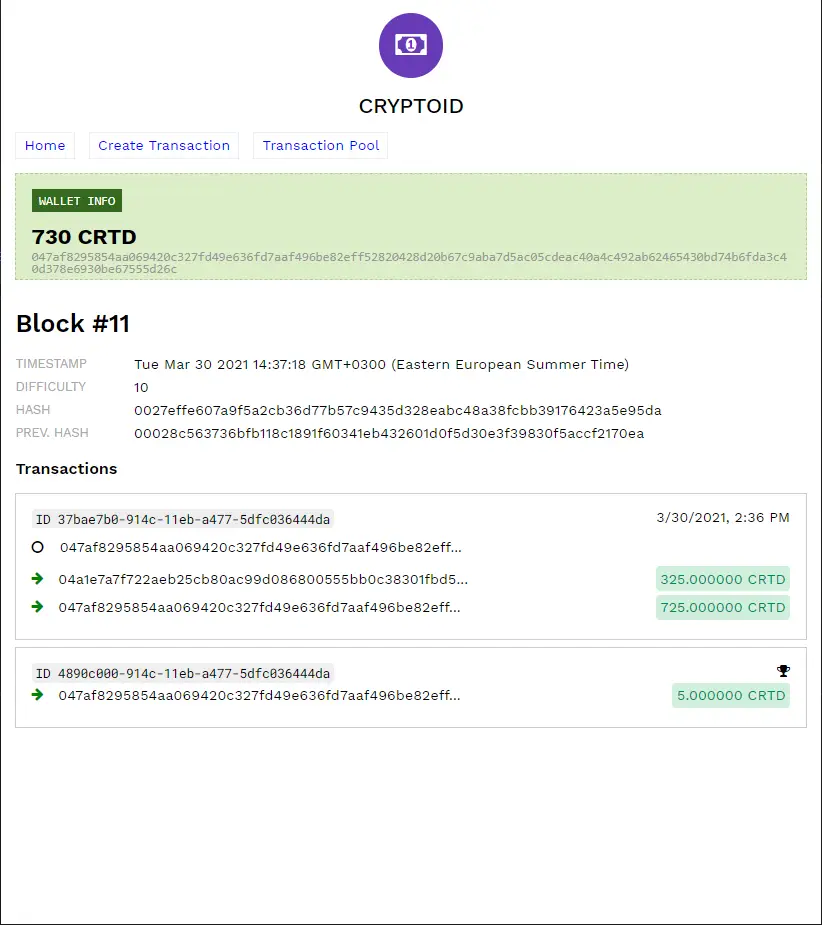

# Cryptoid

A complete blockchain-powered cryptocurrency system, created for educational purposes.

## Features
* Complete implementation of core blockchain and cryptocurrency concepts
* Node.js backend with Express.js
* Simple frontend powered by Vue
* Pub/Sub implementation using Redis
* Test-Driven Development (TDD) approach with Jest
* Written entirely in TypeScript

## Screenshots

<a href="./.github/readme/transaction-pool.webp">
</a>

<a href="./.github/readme/block-list.webp">
</a>

<a href="./.github/readme/block-details.webp">
</a>


## Usage

1. Start the main server:
    ```bash
    npm run server
    ```

2. Start a server for each peer:
    ```bash
    npm run server:peer
    ```

3. Navigate to the respective frontends to create transactions and mine new blocks.
